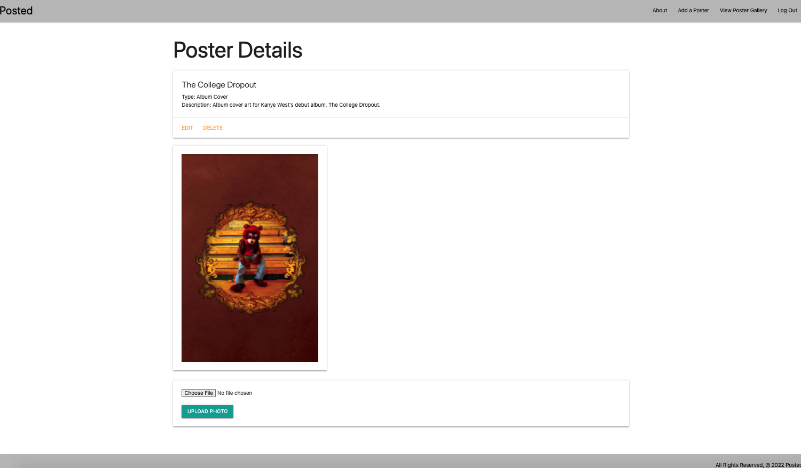

# Posted
#### A gallery for your collection of posters.

## Description
Posted is an app that provides you information and details on the posters you display in your gallery. The app will provide the user the name of the poster, type, and description. Features of the app include creating adding and deleting posters.

## Table of Contents
* [Technologies Used](#technologiesused)
* [Design](#design)
* [Deployed App](#deployment)

## Technologies Used
* Python
* Django

## Trello Planning
* Link to Trello: https://trello.com/b/h2HBPXMH/project-four

## Design
* Design elements implemented using CSS and Materialize

## Deployed Link
* N/A

* You can view the deployed app here:
[Click Here](https://pjt-four-posted.herokuapp.com/)
